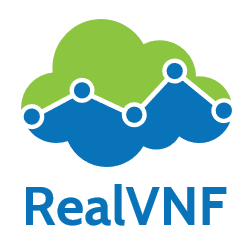

[](https://travis-ci.com/RealVNF/coord-sim)

# Simulation: Inter-node service coordination and flow scheduling

Simulate flow-level, inter-node network coordination including scaling and placement of services and scheduling/balancing traffic between them.

**Features**:

- Simulate any given network topology with arbitrary node and link capacities and link delays
- Simulate any given network service consisting of linearly chained SFs/VNFs
- VNFs can specify arbitrary resource consumption as function of their load using Python modules. Also VNF delay can be specified individually and may be normally distributed.
- Simulate network traffic in the form of flow arrivals at various ingress nodes with varying arrival rate, flow length, volume, etc according to stochastic distributions
- Simple and clear interface to run algorithms for scaling, placement, and scheduling/load balancing of these incoming flows across the nodes in the network. Coordination within each node is out of scope.
- Interface allows easy integration with OpenAI Gym to enable training and evaluating reinforcement learning algorithms
- Collection of metrics like successful/dropped flows, end-to-end delay, resource consumption, etc over time. Easily extensible.
- Discrete event simulation to evaluate coordination over time with SimPy
- Graceful adjustment of placements: When VNFs are removed from a placement by an algorithm. Currently processing flows are allowed to finish processing before the VNF is completely removed (see PR [#78](https://github.com/RealVNF/coordination-simulation/pull/78) and [#81](https://github.com/RealVNF/coordination-simulation/pull/81)).

<p align="center">
    
  
  
</p>

## Setup

Requires Python 3.6. Install with (ideally using [virtualenv](https://virtualenv.pypa.io/en/stable/)):

```bash
pip install -r requirements.txt
```

## Usage

Type `coord-sim -h` for help using the simulator. For now, this should print

```
$ coord-sim -h
usage: coord-sim [-h] -d DURATION -sf SF [-sfr SFR] -n NETWORK -c CONFIG
                 [-t TRACE] [-s SEED]

Coordination-Simulation tool

optional arguments:
  -h, --help            show this help message and exit
  -d DURATION, --duration DURATION
                        The duration of the simulation (simulates
                        milliseconds).
  -sf SF, --sf SF       VNF file which contains the SFCs and their respective
                        SFs and their properties.
  -sfr SFR, --sfr SFR   Path which contains the SF resource consumption
                        functions.
  -n NETWORK, --network NETWORK
                        The GraphML network file that specifies the nodes and
                        edges of the network.
  -c CONFIG, --config CONFIG
                        Path to the simulator config file.
  -t TRACE, --trace TRACE
                        Provide a CSV trace file to configure the traffic the
                        simulator is generating.
  -s SEED, --seed SEED  Random seed
```

You can use the following command as an example (run from the root project folder)

```bash
coord-sim -d 20 -n params/networks/triangle.graphml -sf params/services/abc.yaml -sfr params/services/resource_functions -c params/config/sim_config.yaml
```

This will run a simulation on a provided GraphML network file and a YAML placement file for a duration of 20 timesteps.

### Dynamic SF resource consumption

By default, all SFs have a node resource consumption, which exactly equals the aggregated traffic that they have to handle.

It is possible to specify arbitrary other resource consumption models simply by implementing a python module with a
function `resource_function(load)` (see examples [here](https://github.com/RealVNF/coordination-simulation/tree/master/params/services/resource_functions)).

To use these modules, they need to be referenced in the service file:

```
sf_list:
    a:
      processing_delay_mean: 5.0
      processing_delay_stdev: 0.0
      resource_function_id: A
```

And the path to the folder with the Python modules needs to be passed via the `-sfr` argument.

See PR https://github.com/RealVNF/coordination-simulation/pull/78 for details.

### Egress nodes

- A node can be set to be a `Egress` node in the `NodeType` attribute of the network file
- If some nodes are set as `Egress` then only the simulator will randomly choose one of them as the Egress node for each flow in the network
- If some nodes are set to be Egress then once the flow is processed we check if for the flow, `current node == egress node` . If Yes then we depart , otherwise we forward the flow to the egress_node using the shortest_path routing.
- **Todo**: Ideally the coordination algorithms should keep the path(Ingress to Egress) of the flow in view while creating the schedule/placement.

See [PR 137](https://github.com/RealVNF/coord-sim/pull/137) for details.

### Conversion of real world traffic traces  

Real World traffic traces are available at [sndlib](http://sndlib.zib.de/) under 'Dynamic traffic' at the left. They contain the data rate for every pair of node in a network for every 5 minutes for a timespan of six months. Available data formats are xml and another "native sndlib format". For usage in the simulator this data has to be converted into inter_arrival_mean. A script for that (which works with the xml files) you find here `coord-sim/params/convert_traces/convert_traces.py`. In the same folder you also find an example configuration for the script and an example data set for the first try.
```sh
coord-sim/params/convert_traces$ tree
.
├── abilene_node_name_map.yaml
├── convert_traces.py
├── directed-abilene-zhang-5min-over-6months-ALL
│   ├── demandMatrix-abilene-zhang-5min-20040302-1830.xml
│   ├── demandMatrix-abilene-zhang-5min-20040305-0150.xml
│   ├── demandMatrix-abilene-zhang-5min-20040411-0520.xml
│   ├── demandMatrix-abilene-zhang-5min-20040626-0345.xml
│   ├── demandMatrix-abilene-zhang-5min-20040630-2150.xml
│   ├── demandMatrix-abilene-zhang-5min-20040704-2020.xml
│   ├── demandMatrix-abilene-zhang-5min-20040808-0140.xml
│   ├── demandMatrix-abilene-zhang-5min-20040812-1415.xml
│   ├── demandMatrix-abilene-zhang-5min-20040819-2305.xml
│   └── demandMatrix-abilene-zhang-5min-20040907-0905.xml
└── trace_xml_reader_config.yaml
```

The folder `directed-abilene-zhang-5min-over-6months-ALL` contains 10 xml files from sndlib each standing for traffic in one 5min timespan.
The configuration you find in `trace_xml_reader_config.yaml`. It contains:  
```yaml
source: "directed-abilene-zhang-5min-over-6months-ALL"
# result_trace_filename: <>  # default  = f'{directory}_{_from}-{to}_trace.csv'
# intermediate_result_filename: <>  # default  = result_trace_filename + "_intermediate
# _from: 0 # default 0
# to: 100  # default None, means slice is [_from:]
node_name_map: abilene_node_name_map.yaml  # default None, means leave the names
run_duration: 100  # default 100
scale_factor: 0.001  # default 0.001
change_rate: 2  # default 2
#ingress_nodes:  # default None, means choose all nodes
#  - pop0
#  - pop1
```
Parameter `source` points to the folder with the xml files. Execute:  
```sh
coord-sim/params/convert_traces$ python3 convert_traces.py --config_file trace_xml_reader_config.yaml
[...]
23:20:54: 10  files in directory
23:20:54: Chosen files: os.listdir(directed-abilene-zhang-5min-over-6months-ALL)[0:]
[...]
23:21:00: Written to directed-abilene-zhang-5min-over-6months-ALL_0-None_trace.csv. Last time step 1800
[...]
23:21:00: inter_arrival_mean range: 0.323815912931867, 36.447214465141315
23:21:00: ... mean:  7.381947818616778
23:21:00: ... median:  5.646327364198291
23:21:00: ... std:  5.661472126922231
```
The converted trace is written to `directed-abilene-zhang-5min-over-6months-ALL_0-None_trace.csv`. Reading the files takes most of the time. That's why the script writes some intermediate data to another csv file (in this case it is named `directed-abilene-zhang-5min-over-6months-ALL_0-None_intermediate.csv`). You can reuse it with different parameters by setting the `source` parameter to the filename of the intermediate. For example we want to include not all ingress nodes:
`trace_xml_reader_config.yaml`:
```yaml
source: directed-abilene-zhang-5min-over-6months-ALL_0-None_intermediate.csv
result_trace_filename: ing_pop0_pop1.csv
[...]
ingress_nodes:  # default None, means choose all nodes
  - pop0
  - pop1
```
We also give the resulting trace_file another filename to avoid overwriting:
```sh
coord-sim/params/convert_traces$ python3 convert_traces.py --config_file trace_xml_reader_config.yaml
```
The script will work on the data from the intermediate file. By default filenames are constructed from the directory the arguments `_from` and `to`. You also can assign filenames to to the intermediate and the results file:
`trace_xml_reader_config.yaml`:
```yaml
source: "directed-abilene-zhang-5min-over-6months-ALL"
intermediate_result_filename: directed-abilene-zhang-5min-over-6months-ALL_0-None_intermediate.csv
result_trace_filename: ing_pop0_pop1.csv
[...]
```  
Since a batch from sndlib contains so many files you can choose a sample of them with arguments `_from` and `to`, which defines a slice. The script calls: `os.listdir(source)[_from:to]` if source is a directory. That way you can limit the number of files to read. If `source` is set to an intermediate file it will be also sliced according to those parameters.  
The node names in our network files differ from those in sndlib. To change them a yaml file is assigned. In the above config example parameter `node_name_map` was set to `abilene_node_name_map.yaml`, which looks like this:
```yaml
# defines how to rename nodes (from keys to values). If a node is set to null it will be removed from the
# dataframe. If a node is not mentioned in the yaml it will be ignored, the name will be kept.
ATLAM5: null  # this node is removed and does not appear even in the intermediate
ATLAng: pop9  # renamed from ATLAng to pop9
CHINng: pop1
DNVRng: pop6
HSTNng: pop8
IPLSng: pop10
KSCYng: pop7
LOSAng: pop5
NYCMng: pop0
SNVAng: pop4
STTLng: pop3
WASHng: pop2
```
Save plots of the `data_rate` or the `inter_arrival_mean`:
```sh
coord-sim/params/convert_traces$ python3 convert_traces.py --config_file trace_xml_reader_config.yaml --save_plots data_rate inter_arrival_mean
coord-sim/params/convert_traces$ tree
.
├── abilene_node_name_map.yaml
├── convert_traces.py
├── directed-abilene-zhang-5min-over-6months-ALL
│   ├── demandMatrix-abilene-zhang-5min-20040302-1830.xml
│   ├── [...]
│   └── demandMatrix-abilene-zhang-5min-20040907-0905.xml
├── directed-abilene-zhang-5min-over-6months-ALL_0-None_intermediate.csv
├── directed-abilene-zhang-5min-over-6months-ALL_0-None_trace.csv
├── directed-abilene-zhang-5min-over-6months-ALL_0-None_trace_data_rate.png            <---
├── directed-abilene-zhang-5min-over-6months-ALL_0-None_trace_inter_arrival_mean.png   <---
├── directed-abilene-zhang-5min-over-6months-ALL_0-None_trace_meta.yaml
└── trace_xml_reader_config.yaml
```
Save plots as pdf:
```sh
coord-sim/params/convert_traces$ python3 convert_traces.py --config_file trace_xml_reader_config.yaml --save_plots data_rate inter_arrival_mean --plot_format pdf
```
Show plots in the end of the script by calling plt.show():
```sh
coord-sim/params/convert_traces$ python3 convert_traces.py --config_file trace_xml_reader_config.yaml --plot data_rate inter_arrival_mean
```
For more information look at the doctrings in the script or the comments in the example config.   

#### Overall abilene intermediate file

We have an intermediate csv-file [overall_abilene_intermediate.csv](https://github.com/RealVNF/coord-sim/blob/master/params/convert_traces/overall_abilene_intermediate.csv), which contains the whole abilene batch from sndlib with 48 thousand time step. It is recommended to use it for producing traces for the abilenme network by setting the `source` parameter in config to it. 

## Tests

```bash
# style check
flake8 src

# tests
nose2
```

## Acknowledgement

This project has received funding from German Federal Ministry of Education and Research ([BMBF](https://www.bmbf.de/)) through Software Campus grant 01IS17046 ([RealVNF](https://realvnf.github.io/)).

<p align="center">
  
  
</p>
